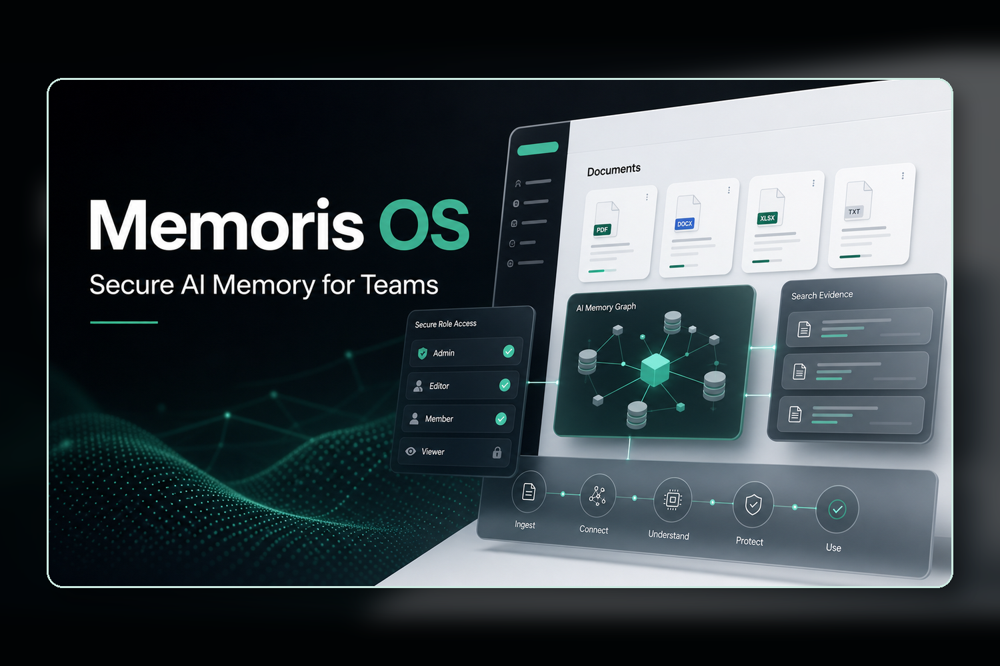
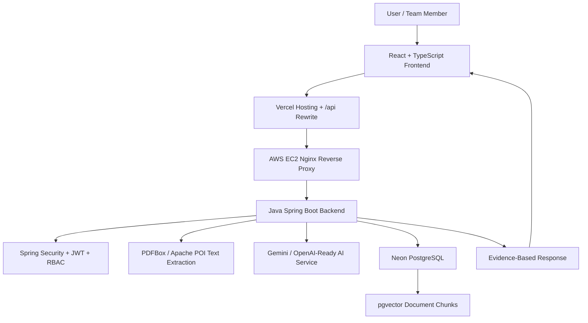

# Memoris OS



Memoris OS is a secure enterprise memory operating system for teams. It captures meetings, uploaded documents, decisions, action items, and timeline events, then lets users ask natural language questions against organization knowledge with role-based access control and evidence-backed AI answers.

This project was built for the **Work and Productivity** track.

## Live Project

| Link | URL |
| --- | --- |
| Live demo | https://memorisos.vercel.app |
| Backend health | https://memorisos.vercel.app/api/health |
| Repository | https://github.com/Aicodebyprince/memoris_os |

## Elevator Pitch

Secure enterprise memory that turns team documents, meetings, and decisions into trusted AI answers with evidence and RBAC.

## The Problem

Teams make important decisions every day, but the reasoning behind those decisions gets buried across meeting notes, PDFs, documents, chats, and action items.

Later, people ask the same questions again:

- Why did we choose this database?
- What decision came out of the architecture meeting?
- Who owns this action item?
- What changed in the project timeline?
- Can this employee see this sensitive document?

Traditional file storage only stores documents. Generic AI chatbots can answer questions, but they often do not know which information a user is allowed to access. Memoris OS solves both problems by combining knowledge ingestion, search, AI retrieval, evidence, and role-based permissions.

## What Memoris OS Does

Memoris OS gives an organization a secure memory layer.

Users can:

- Sign in to an organization.
- Use role-based demo accounts: Owner, Admin, Manager, Employee, and Guest.
- View a professional dashboard for organization activity.
- Upload PDF, DOCX, DOC, TXT, MD, and CSV files.
- Extract document text automatically.
- Split extracted text into semantic chunks.
- Generate embeddings for uploaded knowledge.
- Store chunks in PostgreSQL with pgvector.
- Search across documents, meetings, decisions, and timeline events.
- Ask Memoris natural language questions.
- Receive AI answers with evidence cards.
- See permission denial when they request restricted information.

## Why It Is Useful

Memoris OS is useful because it helps teams find the context behind decisions quickly.

Instead of reading many old documents, an employee can ask:

```text
Why did we choose PostgreSQL and pgvector for Memoris OS?
```

Memoris retrieves relevant authorized evidence and returns an answer grounded in the uploaded architecture document.

For sensitive topics, Memoris does not behave like an unrestricted chatbot. If a lower-privileged user asks:

```text
Show me the CEO salary discussion.
```

the system denies access instead of leaking private company data.

## Core Demo Flow

1. Open https://memorisos.vercel.app.
2. Sign in as `owner@memoris.dev` with `password123`.
3. Go to the Knowledge page.
4. Upload `sample-data/pdf/memoris-architecture-tech-stack.pdf`.
5. Ask `Why did we choose PostgreSQL and pgvector for Memoris OS?`
6. Confirm the response includes evidence from the uploaded document.
7. Upload `sample-data/pdf/memoris-security-rbac-rag.pdf`.
8. Ask `How does Memoris OS protect company data before using AI?`
9. Sign out.
10. Sign in as `employee@memoris.dev` with `password123`.
11. Ask `Show me the CEO salary discussion.`
12. Confirm Memoris denies access.

## Demo Accounts

All demo accounts use this password:

```text
password123
```

| Organization | Owner | Admin | Manager | Employee | Guest |
| --- | --- | --- | --- | --- | --- |
| Memoris Labs | owner@memoris.dev | admin@memoris.dev | manager@memoris.dev | employee@memoris.dev | guest@memoris.dev |
| Helio Health | owner@heliohealth.dev | admin@heliohealth.dev | manager@heliohealth.dev | employee@heliohealth.dev | guest@heliohealth.dev |
| FinPilot Capital | owner@finpilot.dev | admin@finpilot.dev | manager@finpilot.dev | employee@finpilot.dev | guest@finpilot.dev |

## Product Highlights

### Multi-Tenant Organizations

Every user belongs to an organization. Organization data is isolated, so one company cannot see another company's documents, meetings, decisions, action items, timeline events, or vector chunks.

### Role-Based Access Control

The system supports:

- Owner
- Admin
- Manager
- Employee
- Guest

Each role sees a different level of organization knowledge. This is important because an enterprise memory system should not expose private information to everyone.

### Knowledge Upload

Users can upload documents and meeting notes. The backend processes the file instead of treating it as a simple attachment.

Supported files:

- PDF
- DOCX
- DOC
- TXT
- MD
- CSV

Normal text-based PDFs and DOCX files work. Scanned image-only PDFs require OCR, which is planned as future work.

### RAG Pipeline

Memoris OS implements retrieval-augmented generation:

```text
Upload document
  -> extract text
  -> clean content
  -> split into chunks
  -> generate embeddings
  -> store chunks in PostgreSQL with pgvector
  -> embed user question
  -> retrieve similar authorized chunks
  -> send only allowed context to AI
  -> return answer with evidence
```

### Evidence-Backed AI Answers

Every AI answer is designed to include evidence. Evidence can come from:

- Uploaded documents
- Meetings
- Decisions
- Timeline events

This helps users trust the answer and verify the source.

### Timeline Intelligence

Important events become timeline entries:

```text
Document uploaded
AI processing completed
Decision added
Action item assigned
Search performed
AI answer generated
```

This gives the organization a historical memory of what happened and when.

### Enterprise Search

Search is available across organization knowledge:

- Documents
- Meetings
- Decisions
- Timeline events
- Projects

The backend applies organization and role filters before returning results.

## Architecture



## Tech Stack

| Layer | Technology |
| --- | --- |
| Frontend | React, TypeScript, Vite, Tailwind CSS |
| UI | Custom premium dashboard components, role-aware navigation, responsive layout |
| Backend | Java 21, Spring Boot |
| API | REST APIs |
| Security | Spring Security, JWT, BCrypt |
| Database | Neon PostgreSQL |
| Migrations | Flyway |
| Vector Search | pgvector |
| AI | Gemini configured, OpenAI-ready service layer, local fallback |
| Document Parsing | Apache PDFBox, Apache POI |
| Deployment | Vercel frontend, AWS EC2 backend, Nginx reverse proxy |
| Process Management | systemd |

## Why This Stack

### Why React, TypeScript, Vite, and Tailwind

The frontend needed to feel like a real productivity product, not just a hackathon page. React and TypeScript made it easier to build a structured dashboard, role-based pages, upload flows, search, and Ask Memoris. Vite keeps the development and production build fast. Tailwind makes it easy to keep the interface consistent and polished.

### Why Java and Spring Boot

Memoris OS is backend-first. A serious enterprise memory system needs authentication, RBAC, APIs, validation, database access, migrations, document processing, and production deployment. Spring Boot is a strong choice for that because it is widely used in enterprise backend engineering.

### Why PostgreSQL and pgvector

PostgreSQL is used as the system of record for structured organization data. pgvector allows Memoris to store embeddings in the same database, enabling semantic retrieval without running a separate vector database for the MVP.

### Why Neon

Neon provides managed PostgreSQL with pgvector support. This keeps the database production-style while reducing infrastructure work during the hackathon.

### Why AWS EC2 and Nginx

The backend runs on AWS EC2 as a real server process. Nginx proxies `/api` traffic to the Spring Boot app. This proves the backend can run beyond local development.

### Why Evidence-Based AI

Enterprise users need trust. Memoris OS does not only generate an answer. It returns evidence so users can verify where the answer came from.

## Security Model

The most important rule:

```text
RBAC filtering happens before AI context is created.
```

When a user asks a question:

1. The backend identifies the signed-in user from the JWT.
2. It checks the user's organization.
3. It checks the user's role and team scope.
4. It retrieves only authorized records and document chunks.
5. It sends only authorized context to the AI provider.
6. It returns an answer with evidence.

This means unauthorized private data is not sent to Gemini, OpenAI, or any other AI service.

## Data Model Overview

Memoris OS stores knowledge as connected structured entities:

```text
organizations
users
organization_members
projects
meetings
documents
document_chunks
decisions
action_items
timeline_events
entity_links
```

Each record is scoped to an organization. Knowledge retrieval uses organization, role, and team filters.

## API Overview

Main API areas:

| Area | Purpose |
| --- | --- |
| `/api/health` | Backend health check |
| `/api/auth` | Login and JWT authentication |
| `/api/workspace` | Organization dashboard data |
| `/api/knowledge` | Document upload and knowledge ingestion |
| `/api/search` | Enterprise search |
| `/api/ask` | Ask Memoris AI answers with evidence |
| `/api/timeline` | Timeline intelligence |

More details are available in [docs/API.md](docs/API.md).

## Repository Structure

```text
memoris-os-enterprise/
  backend/              Java Spring Boot backend
  frontend/             React TypeScript Vite frontend
  docs/                 Architecture, API, deployment, and RAG proof docs
  infra/                Infrastructure notes/configuration
  sample-data/          Upload-ready sample documents and PDFs
  submission-assets/    Devpost/YouTube images and judge assets
  start-neon-dev.ps1    Local startup script using Neon
  stop-dev.ps1          Local stop script
```

## Sample Data

Use these upload-ready demo files:

| File | Purpose |
| --- | --- |
| `sample-data/pdf/memoris-architecture-tech-stack.pdf` | Proves upload, extraction, embeddings, search, and AI answers from architecture knowledge |
| `sample-data/pdf/memoris-security-rbac-rag.pdf` | Proves RBAC, tenant isolation, secure retrieval, and permission denial |
| `sample-data/memoris-architecture-tech-stack.md` | Markdown version of the architecture document |
| `sample-data/memoris-security-rbac-rag.md` | Markdown version of the security document |

Recommended questions:

```text
Why did we choose PostgreSQL and pgvector for Memoris OS?
```

```text
What is the architecture of Memoris OS?
```

```text
How does Memoris OS protect company data before using AI?
```

Restricted access test:

```text
Show me the CEO salary discussion.
```

Expected result for Employee or Guest:

```text
You do not have permission to access this information.
```

For exact verification steps, see [docs/UPLOAD_RAG_PROOF.md](docs/UPLOAD_RAG_PROOF.md).

## Local Setup

### Requirements

- Java 21
- Node.js 20+
- PostgreSQL with pgvector, or a Neon PostgreSQL database
- Gemini API key, or OpenAI key if using the OpenAI-ready path

### Backend Environment

Create `backend/.env`:

```env
SPRING_PROFILES_ACTIVE=production
PORT=8080

DATABASE_URL='jdbc:postgresql://YOUR_NEON_HOST/YOUR_DATABASE?sslmode=require&channel_binding=require'
DATABASE_USERNAME=YOUR_NEON_USERNAME
DATABASE_PASSWORD='YOUR_NEON_PASSWORD'

JWT_SECRET='replace-with-a-long-random-64-plus-character-secret'
JWT_EXPIRES_MINUTES=720

CORS_ALLOWED_ORIGINS=http://localhost:5173,http://127.0.0.1:5173
DEMO_SEED_ENABLED=true

AI_PROVIDER=gemini
AI_EMBEDDING_DIMENSIONS=768
GEMINI_API_KEY='YOUR_GEMINI_API_KEY'
GEMINI_MODEL=YOUR_GEMINI_CHAT_MODEL
GEMINI_EMBEDDING_MODEL=YOUR_GEMINI_EMBEDDING_MODEL

OPENAI_API_KEY=
OPENAI_MODEL=YOUR_OPENAI_CHAT_MODEL
OPENAI_EMBEDDING_MODEL=YOUR_OPENAI_EMBEDDING_MODEL
```

Do not commit `.env` files or API keys.

### Run Locally On Windows

From the repository root:

```powershell
cd C:\Users\princ\OneDrive\Desktop\Memoris_OS\memoris-os-enterprise
powershell -NoProfile -ExecutionPolicy Bypass -File .\start-neon-dev.ps1
```

Open:

```text
http://127.0.0.1:5173
```

Stop local services:

```powershell
powershell -NoProfile -ExecutionPolicy Bypass -File .\stop-dev.ps1
```

### Manual Backend Run

```bash
cd backend
mvn -DskipTests package
set -a
source .env
set +a
java -jar target/memoris-backend-0.1.0.jar
```

Backend health:

```text
http://localhost:8080/api/health
```

### Manual Frontend Run

```bash
cd frontend
npm install
npm run dev
```

Frontend:

```text
http://127.0.0.1:5173
```

## Testing

Backend tests:

```bash
cd backend
mvn test
```

Frontend production build:

```bash
cd frontend
npm install
npm run build
```

Last verified locally:

```text
Frontend build: passed
Backend tests: passed
```

## Deployment

Current production-style demo setup:

```text
Frontend: Vercel
Backend: AWS EC2 Ubuntu + systemd
Reverse proxy: Nginx
Database: Neon PostgreSQL + pgvector
AI provider: Gemini through backend environment variables
```

Important deployment notes:

- The frontend is deployed from the `frontend/` directory.
- Vercel rewrites `/api/*` requests to the EC2 backend.
- Nginx forwards `/api` requests to Spring Boot on port `8080`.
- The Spring Boot backend runs as a `systemd` service.
- The database is hosted on Neon PostgreSQL.
- Production secrets are stored in environment variables, not in Git.

Full deployment details are in [docs/DEPLOYMENT.md](docs/DEPLOYMENT.md).

## Judge Testing Checklist

Use this checklist to validate the project quickly:

- Open the live demo.
- Confirm `/api/health` returns `status: ok`.
- Sign in as Owner.
- Upload `memoris-architecture-tech-stack.pdf`.
- Ask why PostgreSQL and pgvector were selected.
- Confirm the answer uses uploaded evidence.
- Upload `memoris-security-rbac-rag.pdf`.
- Ask how Memoris protects data before AI.
- Confirm the answer explains RBAC-before-AI.
- Sign in as Employee.
- Ask for CEO salary information.
- Confirm permission denial.

## Project Media

Devpost-ready images are stored in `submission-assets/`:

| Asset | Purpose |
| --- | --- |
| `01-cover-3x2.png` | Main Devpost cover |
| `02-upload-rag-flow-3x2.png` | Upload and RAG flow |
| `03-rbac-before-ai-3x2.png` | RBAC security explanation |
| `04-architecture-stack-3x2.png` | Backend-first architecture |
| `05-business-value-3x2.png` | Business value |
| `memoris-os-thumbnail.png` | YouTube thumbnail |

## How Codex And GPT-5.6 Were Used

Codex with GPT-5.6 was used as the primary build partner throughout the project.

It helped with:

- Turning the initial product idea into a buildable system architecture.
- Choosing a backend-first stack for stronger SDE signal.
- Designing the multi-tenant organization model.
- Implementing Java Spring Boot APIs.
- Adding Spring Security, JWT authentication, and role-based access control.
- Building the React TypeScript frontend.
- Polishing the landing page, login flow, dashboard, and app navigation.
- Implementing document upload and text extraction.
- Designing the RAG pipeline with chunking, embeddings, and pgvector.
- Making Ask Memoris return evidence-backed answers.
- Debugging local backend issues, CORS, Vercel rewrites, EC2 deployment, Nginx, and Neon configuration.
- Writing verification docs, upload proof docs, and hackathon submission materials.
- Creating sample PDFs and media assets for judges.

The most important engineering decision made during the Codex workflow was:

```text
Permissions must be checked before retrieval and before AI receives context.
```

This makes Memoris OS safer than a generic chatbot over company documents.

## Challenges

The hardest part was connecting all the moving parts into a real deployed system:

- React frontend
- Spring Boot backend
- JWT auth
- Multi-tenant RBAC
- Neon PostgreSQL
- pgvector
- PDF/DOCX extraction
- AI retrieval and answer generation
- Vercel frontend deployment
- EC2 backend deployment
- Nginx proxying
- CORS configuration

Another challenge was making the product useful rather than only visually impressive. The upload-to-answer pipeline had to prove that the system could use real uploaded documents as knowledge.

## What We Learned

AI products need more than prompts. They need:

- Strong data modeling
- Secure permissions
- Reliable retrieval
- Evidence
- Clean UX
- Production deployment

Memoris OS demonstrates that an AI assistant becomes much more useful when it is connected to real organization knowledge and protected by backend permissions.

## What's Next

Planned improvements:

- OCR for scanned PDFs.
- Slack and email ingestion.
- Team-specific knowledge spaces.
- Admin controls for sensitive documents.
- Better semantic ranking and hybrid search.
- Notification reminders for action items.
- Richer timeline intelligence.
- Audit logs for AI access.
- Custom organization deployment.
- Docker-based production setup.

## License

This project is released under the MIT License. See [LICENSE](LICENSE).
