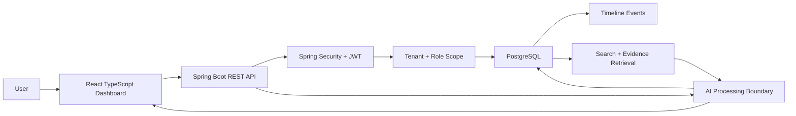

# Architecture

## System View

## Backend Modules

| Package | Responsibility |
| --- | --- |
| `auth` | Register, login, JWT issuing |
| `config` | Security chain, JWT request filter, CORS |
| `organization` | Tenant model and membership role |
| `knowledge` | Meetings, documents, decisions, action items, projects |
| `timeline` | Timeline Intelligence events |
| `search` | Enterprise search and Ask Memoris |
| `dashboard` | Overview widgets and metrics |
| `seed` | Local profile demo organization |

## Tenant Boundary

Every user belongs to an organization through `organization_members`. The backend resolves the membership from the JWT subject on every request and builds a `CurrentUser` object:

- `organizationId`
- `userId`
- `role`
- `team`
- `email`

Controllers and services use this object to scope reads and writes. Managers and employees are team-scoped. Owners and admins can read across teams.

## RBAC Before AI

Ask Memoris follows this order:

1. Read authenticated user and organization membership.
2. Reject sensitive requests when the role cannot access them.
3. Search only records visible to that role/team.
4. Build the AI answer from authorized evidence only.
5. Return answer plus evidence.

This is the strongest system-design talking point in the project.

## Timeline Intelligence

Timeline events are created for:

- meeting created
- summary generated
- decision added
- action item assigned
- document uploaded
- search performed
- AI answer generated

This turns normal CRUD into explainable organizational history.

## Database Direction

Phase 1 uses normalized PostgreSQL tables plus indexes. Phase 2 should add:

- `document_chunks`
- `embedding vector(1536)` or model-specific dimensions
- pgvector cosine similarity index
- hybrid keyword + semantic search
